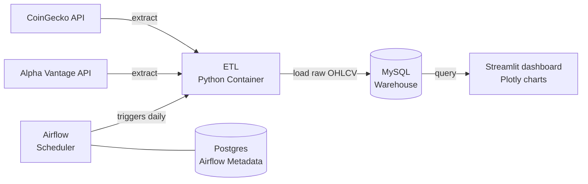

# crypto-stock-pipeline

A data engineering project that pulls daily price data for cryptocurrency and stocks, stores it in a database, and displays it in an interactive dashboard. Built to develop hands-on skills in ETL pipelines, data warehousing, and dashboard development.

**Crypto**
- BTC (Bitcoin)
- ETH (Ethereum)
- XRP (Ripple)
- XLM (Stellar)

**Stocks**
- AAPL (Apple)
- AMZN (Amazon)
- MSFT (Microsoft)
- GOOGL (Google)

## Architecture
 

## Deployment: Docker → Proxmox Homelab
The project was built and containerized locally on macOS, then lifted onto a Proxmox VE server (Dell OptiPlex 3090) where it runs 24/7 as a live pipeline. Because the entire stack is defined in Docker Compose, migrating from the laptop to the homelab required no application changes - the same compose file runs in both environments.

## Project Goals
- Build an automated daily data pipeline
- Store clean, structured data in a database
- Display insights in an interactive dashboard
- Backfill data from 2026-01-01 to date

## Tech Stack
- **Python** — Extraction and pipeline logic
- **MySQL** — Warehouse storage
- **Apache Airflow** — Daily scheduling and orchestration
- **Docker / Docker Compose** — Containerization and environment parity
- **Proxmox VE** — Self-hosted virtualization for always-on deployment
- **Streamlit + Plotly** — Dashboard and visualization

## Roadmap
- [x] Set up project structure and GitHub repository
- [x] Connect to API and explore raw data
- [x] Design database schema
- [x] Write ETL pipeline script
- [x] Build interactive dashboard with Streamlit
- [x] Schedule pipeline with Airflow
- [x] Containerize full stack with Docker Compose
- [x] Deploy to Proxmox homelab
